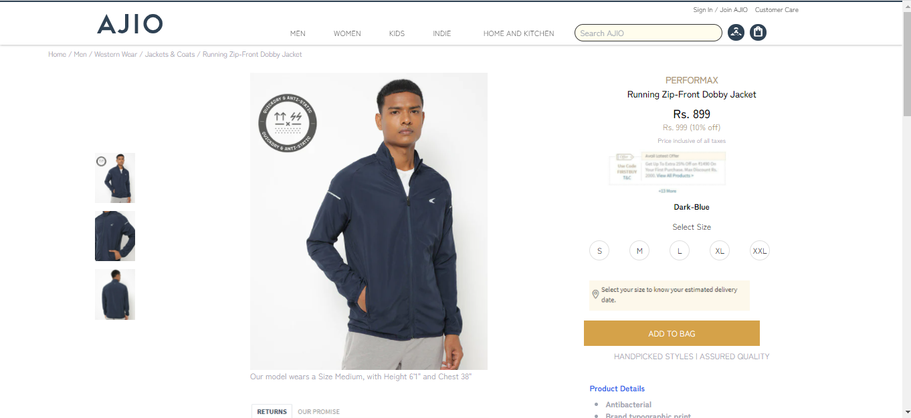

Clone Ajio.com
link: https://impcakash.github.io/Ajio.com/

This is the clone of Ajio.com, which we made during the UNIT III construct week. This website behaves the same as Ajio.com in functionality.

## Screenshots

## Website Flow :

## Technologies Used

- HTML
- CSS
- Tailwind CSS
- JavaScript

## Authors

- [Saurabh Nimkande](https://github.com/saurabhnimkande)
- [Thota Pavan Kumar](https://github.com/ThotaPavanKumar)
- [Shubham Kumar](https://github.com/shubhamkr0412)
- [Prakash Chandra Akash](https://github.com/impcakash)
- [Raman Boddula](https://github.com/raman-boddula)
- [Alimul Hassan](https://github.com/alhassan069)
